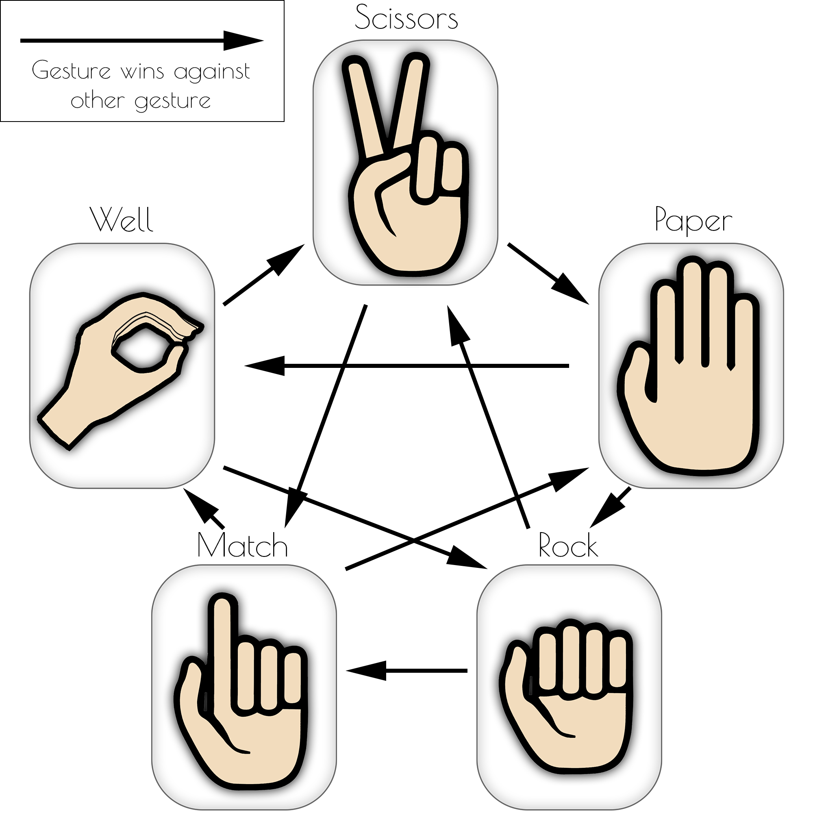

# Rock-Paper-Scissor gesture-data of Senso Data Glove

The data set consists of rock-paper-scissor gestures of 20 different persons (9 female, 11 male) between 7 and 72 years old which were recorded with a (right) data glove [Senso Glove DK2](https://senso.me). In addition to the familiar gestures of rock, paper, and scissors, additional gestures for well and match were also recorded:

Each gesture was performed 10 times in a row by each person. After each gesture, the data glove was recalibrated. The participants were shown a graphic of the respective gesture, otherwise, they were blind to other participants.
More information about the data acquisition and the data glove can be found in the paper "Rock beats Scissor: SVM based gesture recognition with data gloves" by Achenbach et al. (although a different data set was used there).

The following data of the data glove were recorded:
|Value|Datatype|Used|Floats|
|--|--|--|--|
|Thumb Angles|Vector2|YES|2|
|Thumb Quaternion|Quaternion|YES|4|
|Thumb Bend|Float|YES|1|
|Index Finger Angles|Vector2|YES|2|
|Middle Finger Angles|Vector2|YES|2|
|Ring Finger Angles|Vector2|YES|2|
|Little Finger Angles|Vector2|YES|2|
|Palm Position|Vector3|NO|(3)|
|Palm Rotation|Quaternion|NO|(4)|
|Palm Magnetometer|Vector3|NO|(3)|
|Wrist Rotation|Quaternion|NO|(4)|
|Wrist Magnetometer|Vector3|NO|(3)|
||||= 15 (32)|
