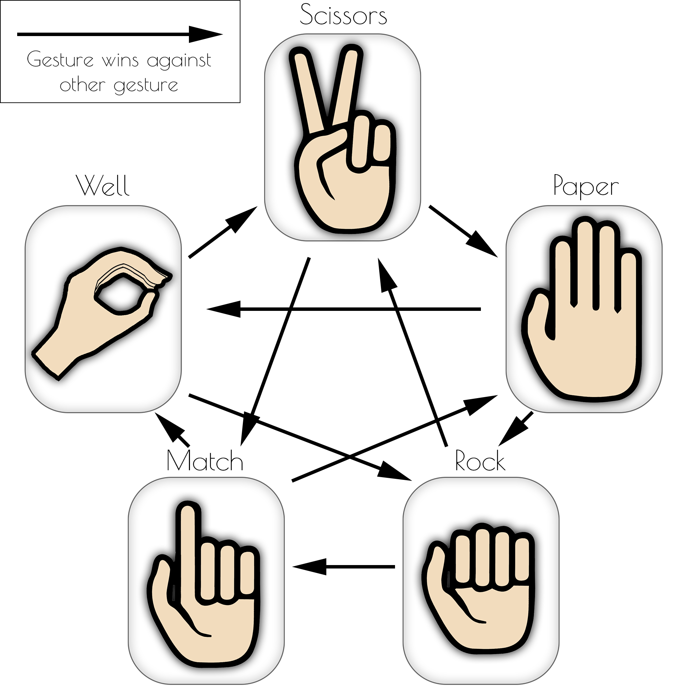
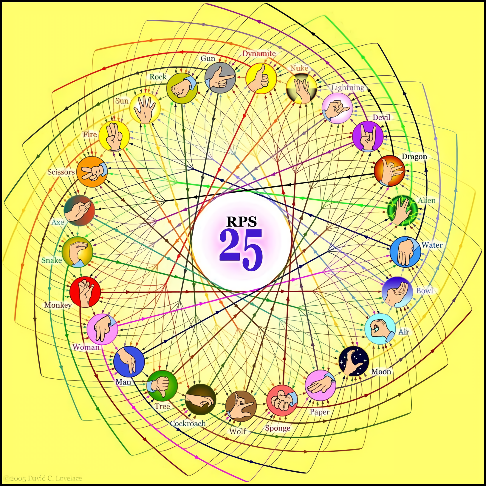

# Rock-Paper-Scissor gesture-data of Senso Data Glove

You will find here two datasets for the well-known game Rock-Paper-Scissors in two different versions: First one with 5 different gestures and second one with 25 gestures.

Each gesture was performed 10 times in a row by each person and were recorded with a (right) data glove [Senso Glove DK2](https://senso.me). After each gesture, the data glove was recalibrated. The participants were shown a graphic of the respective gesture, otherwise, they were blind to other participants.
More information about the data acquisition and the data glove can be found in the paper "Rock beats Scissor: SVM based gesture recognition with data gloves" by Achenbach et al. (although a different data set was used there).

The following data of the data glove were recorded:
|Value|Datatype|Used|Floats|Detail|
|--|--|--|--|--|
|Thumb Angles|Vector2|YES|2|yaw, pitch|
|Thumb Quaternion|Quaternion|YES|4|w, x, y, z|
|Thumb Bend|Float|YES|1|bend|
|Index Finger Angles|Vector2|YES|2|yaw, pitch|
|Middle Finger Angles|Vector2|YES|2|yaw, pitch|
|Ring Finger Angles|Vector2|YES|2|yaw, pitch|
|Little Finger Angles|Vector2|YES|2|yaw, pitch|
|Palm Rotation|Quaternion|(YES)\*|(4)|w, x, y, z|
|Palm Magnetometer|Vector3|NO|-|-|
|Palm Position|Vector3|NO|-|-|
|Wrist Rotation|Quaternion|NO|-|-|
|Wrist Magnetometer|Vector3|NO|-|-|
||||= 15 (19)|

\* *Palm Rotation* was only used in 25 gestures version

## 5 gesture version

The data set consists of rock-paper-scissor gestures of 20 different persons (9 female, 11 male) between 7 and 72 years old. In addition to the familiar gestures of *Rock*, *Paper*, and *Scissors*, additional gestures for well and match were also recorded:

Unfortunately the file "Well202101300545" was not saved.

## 25 gesture version

The data set consists of rock-paper-scissor gestures of 9 different persons (2 female, 7 male) between 23 and 57 years old. In addition to the familiar gestures of *Rock*, *Paper*, and *Scissors*, 22 more gestures were also recorded:

Unlike the version with 5 gestures, these gestures also depend on the orientation of the hand (e.g. ...). The *Well* and *Match* gestures do not exist in this version (even though the new *Air* gesture has the same handshape as *Well*).

We hereby thank David C. Lovelace, who designed this version of the game and from whose site we also used the graphics: [Rock-Paper-Scissors Variants](https://www.umop.com/rps.htm)
